# TrackBallBar Slim
TrackBallBar Slimは、「今あるキーボードにトラックボールとスクロールホイールを」をコンセプトに作成した有線トラックボールです。
TrackBallBar(未リリース)の機能削減、サイズ変更版です。

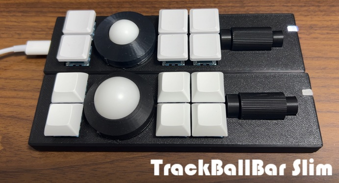

## 特徴
- 完成品ですぐに使えます。追加で必要なのはUSB-Cケーブルのみです。
- 有線式でバッテリーを気にする必要がありません。(デメリットでもあります。)
- トラックボールとスクロールホイールがあります。
- トラックボールは19mm球、25mm球が使えます。
- トラックボールはベアリング支持で、軽い力で動きます。(若干うるさいです。)
- LEDインジケータがあり、発光色で使用レイヤーがわかります。
- Vialによるカスタマイズが可能です。8レイヤーまで対応します。
- MX互換キースイッチの交換が可能です。
- 19mm球使用時で30.9mm、25mm球で36.6mm(実測)の高さです。 

## パッケージ内容
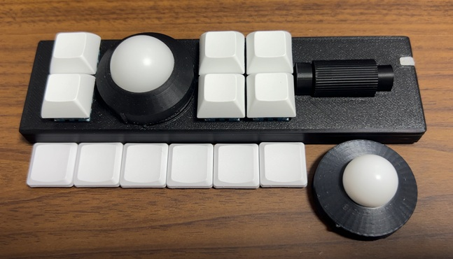
- TrackBallBar Slim本体 1台
- 25mm POM球(取付済) 1個
- ミネベアミツミ製ミニチュアベアリングDDL-630ZZ(内径3mm、外径6mm、厚さ2.5mm) 3個(取付済)
- 3×8mm ステンレス平行ピンh7 3個(取付済)
- 25mm球用ボールカバー 1個(取付済)
- Yushakobo Fairy Silent Linear Switch(MX互換静音キースイッチ 35g) 6個(取付済)
- DSAキーキャップ 白 6個(取付済)
- GRIPLUS ヘキサゴン 4個(取付済)
- 19mm POM球 1個
- 19mm球用ボールカバー 1個
- Tai-Hao Thinsキーキャップ 白 6個

## サイズ
- 幅: 157mm
- 奥行: 45mm
- 高さ: 30.9mm(19mm球使用時)/36.6mm(25mm球使用時)

## 内部仕様
- MCU: RP2040
- Flash: Winbond W25Q128JVSIQ(16MB)
- Sensor: PixArt Imaging PMW3360
- Support DPI: 300-3000dpi
- LED: SK6812-MINI-E
- Firmware: vial-qmk

## 各部名称
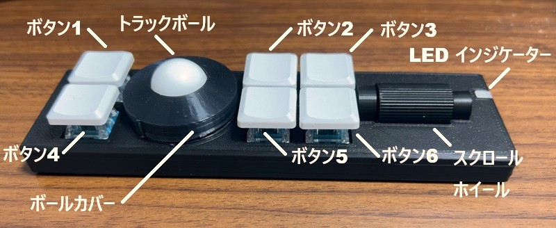
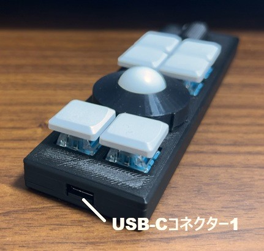
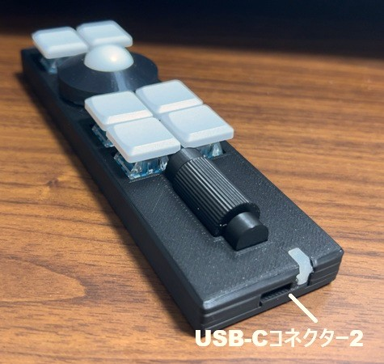
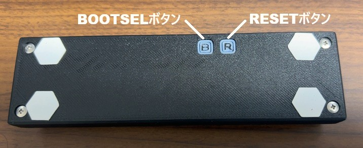

## 使用上の注意
- ケースなどは3Dプリンターによる自家製です。細かい傷などありましても、ご容赦ください。
- ケースなどはPLAで作成しています。50度ほどで変形しますので、温度には注意してください。
- スクロールホイールの軸は3Dプリントしたもので、強度が高くありません。強い力を加えると折れることがあるので、注意してください。
- USB-Cコネクタが２つありますが、同時には接続しないでください。TrackBallBar Slimだけでなく、接続した機器の破損の恐れがあります。
- 滑り止めには保護フィルムが貼られています。使用前にはがしてください。

## LEDインジケーター
現在のレイヤーを発光色で示します。他にも設定値の確認にも使用します。
- レイヤー1: 白
- レイヤー2: 緑
- レイヤー3: 青
- レイヤー4: 水
- レイヤー5: 黄
- レイヤー6: 橙
- レイヤー7: ピンク
- レイヤー8: 赤

## トラックボールサイズの変更方法
1. ボールカバーを逆時計回りに回し、出っ張りが正面にきたところで上に持ち上げて外します。
2. 3つのベアリングを小型のマイナスドライバーで下から持ち上げ外します。
3. ベアリングを使用するボールの箇所に取り付けます。取り付けるときは、ベアリングのシャフトの両端を同時に押してはめ込んでください。
- 19mm球のベアリング位置 
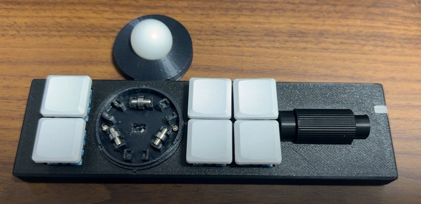
- 25mm球のベアリング位置 
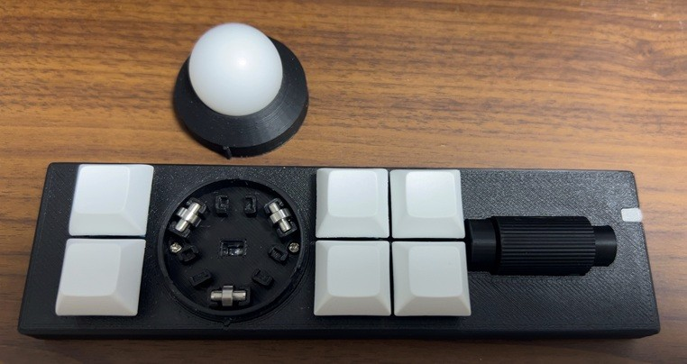
4. 使用するボール用のボールカバーを取り付けます。取り付けるときは出っ張りを正面にしてはめ込み、時計回りで回してください。
5. お好みでキーキャップを交換してください。

## キースイッチの交換
キースイッチソケットを使用しており、キースイッチを交換することができます。キースイッチを上に引き抜いてください。
交換できるのはMX互換のキースイッチです。

## デフォルトのキーマップ

- ボタン1: 左クリック
- ボタン2: 左クリック
- ボタン3: DPI半減(押している間)
- ボタン4: 右クリック
- ボタン5: 右クリック
- ボタン6: スクロールホイール切り替え(押している間、垂直スクロールから水平スクロールに切り替え)
- ボタン1+ボタン3: トラックボールセンサー角度変更(4方向)
- ボタン2+ボタン3: DPI調整
- ボタン5+ボタン6: DPI確認
- スクロールホイール上: 垂直スクロール上 / 水平スクロール左
- スクロールホイール下: 垂直スクロール下 / 水平スクロール右

## トラックボールセンサーの角度変更
ボタン1とボタン3を同時に押すことでトラックボールセンサーの角度を変更します。
ボタンを押すごとに90度回転します。
ボタンを押したときのLEDインジケーターの発光色で現在の角度が確認できます。
- 白: 0度
- 緑: 90度
- 青: 180度
- 赤: 270度

## DPI調整
ボタン2とボタン3を同時に押したまま、スクロールホイールを操作することでDPI調整できます。DPIの調整範囲は300-3000DPIです。
- スクロールホイール上: DPIアップ(+100 DPI)
- スクロールホイール下: DPIダウン(-100 DPI)

LEDインジケーターが白点滅すれば受理、赤点滅すれば上限/下限であることを示します。
ボタン5とボタン6を同時に押すと、現在のDPIをLEDインジケーターで確認できます。
以下の発光色の点灯回数でDPIを確認します。
- 緑: 1000DPI
- 青: 100DPI

## Vialによるカスタマイズ
カスタマイズはVial(https://get.vial.today/)で行えます。 
Vial自体の使用方法の説明はいたしません。

### 初期キーマップ
- レイヤー0 
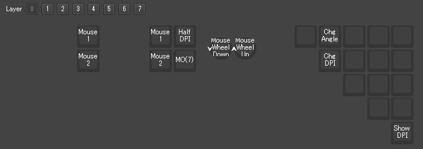
- レイヤー1 

- レイヤー2 
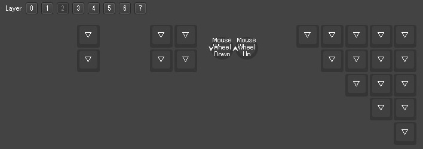
- レイヤー3 
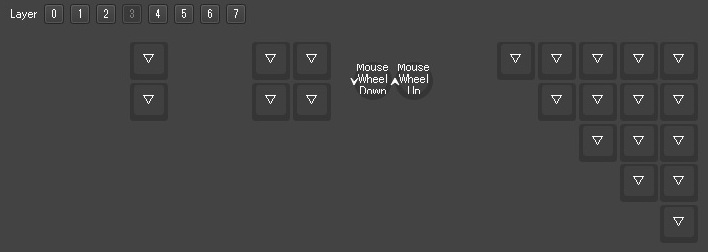
- レイヤー4 

- レイヤー5 

- レイヤー6 

- レイヤー7 
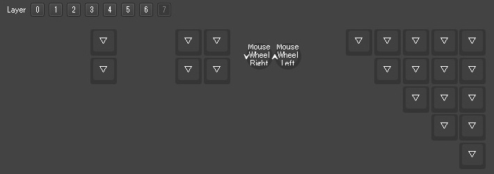

### 固有キー
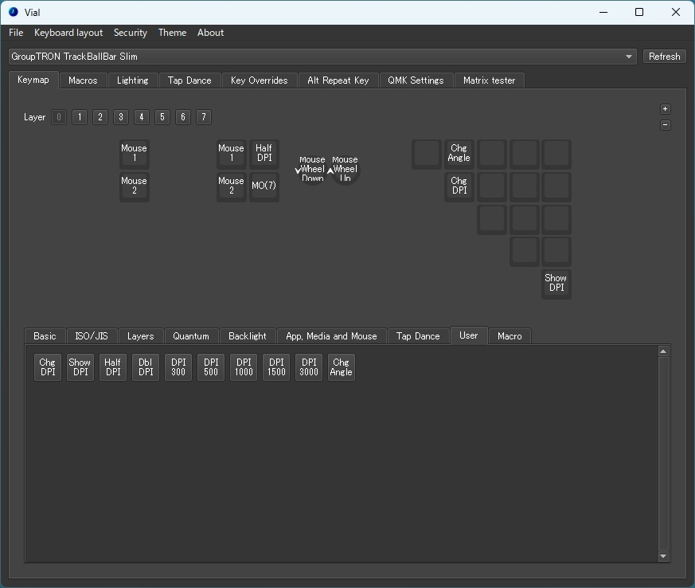

UserタブにあるTrackBallBar Slim固有のキーです。

| キー名      | 機能                                               |
| -------- | ------------------------------------------------ |
| ChgDPI   | DPIを変更します。本キーを押したまま、スクロールホイールを動かすことでDPIを±100します。 |
| ShowDPI  | 現在のDPIをLEDインジケーターで確認します。                         |
| HalfDPI  | 押している間、DPIを半分にします。                               |
| DblDPI   | 押している間、DPIを２倍にします。                               |
| DPI300   | DPIを300に変更します。                                   |
| DPI500   | DPIを500に変更します。                                   |
| DPI1000  | DPIを1000に変更します。                                  |
| DPI1500  | DPIを1500に変更します。                                  |
| DPI3000  | DPIを3000に変更します。                                  |
| ChgAngle | トラックボールセンサーの角度を変更します。押すごとに90度回転します。             |

### 独自コンボ機能
QMKによるコンボ機能ではなく、独自にコンボ機能を作成しています。 
(QMKでは同じキーの同時押しによるコンボができそうになかったため) 
コンボの配置は以下のようになっています。

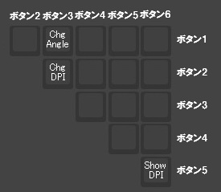

### LEDインジケーターの調整
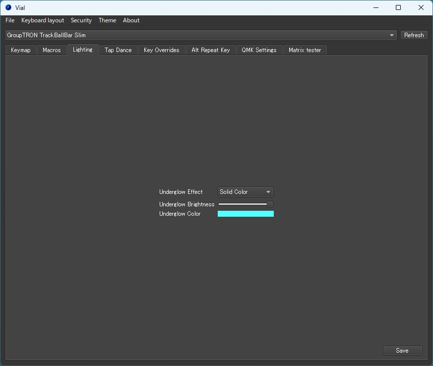

VialのLightingタブでの調整はできません。 
効果があるのは、Underglow Effectを"All Off"にすることでのLEDインジケーターの無効化のみです。 
ただし、以下の操作をするとLEDインジケーターが点灯します。その際には再設定してください。
- DPIの変更
- DPI確認
- トラックボールセンサーの角度変更

## ファームウェア
### ファームウェア変更方法
1. Vial(アプリ版)で現在の設定をファイルに保存してください。
2. 背面のRESETボタンを２回連続で押してください。
3. "RPI-RP2"ディスクが接続されますので、ファームウェアをコピーしてください。
4. Vial(アプリ版)で1のファイルを反映してください。 
(ファームウェアの変更内容によっては反映できないことがあります。)

### ファームウェア履歴
| version            | 説明  | ファームウェア                                                                                | ソース      |
| ------------------ | --- | -------------------------------------------------------------------------------------- | -------- |
| 1.0.0 (2025/12/17) | 初版  | [tbbs_vial_100.uf2 (MD5:a353f087dbedfe9fa974a04edc3cd6b5)](firmware/tbbs_vial_100.uf2) | [link](https://github.com/lalf/vial-qmk/releases/tag/TrackBallBarSlim1.0.0) |
